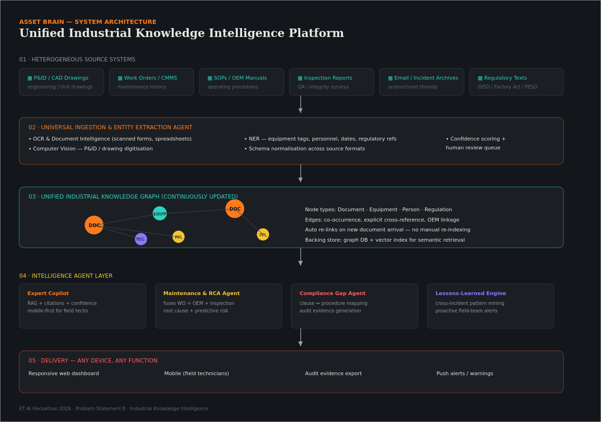
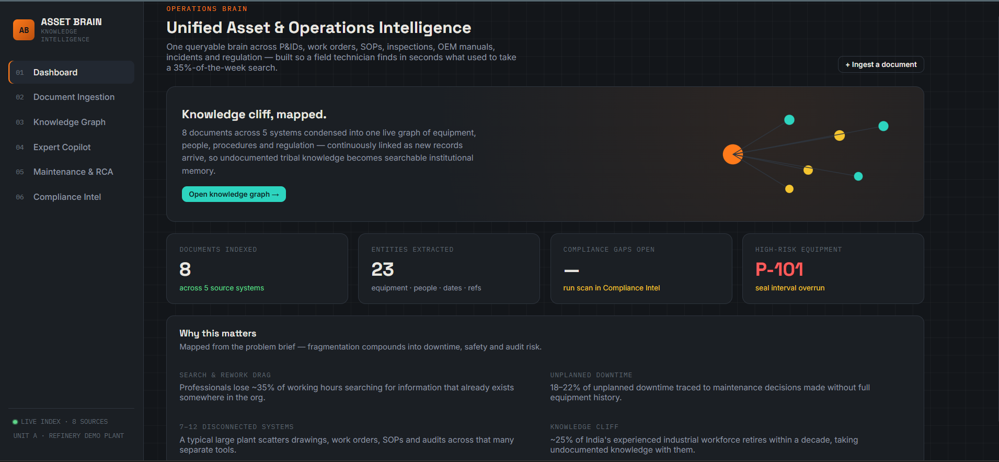

<div align="center">

# 🧠 ASSET BRAIN

### Unified Industrial Knowledge Intelligence Platform

**ET AI Hackathon 2026 • Problem Statement 8**

Transforming fragmented industrial documents into an intelligent, searchable, and explainable knowledge system powered by AI, RAG, and Knowledge Graphs.

</div>

---

## 📌 Overview

Industrial organizations generate vast amounts of information across OEM manuals, maintenance records, inspection reports, incident reports, SOPs, emails, and regulatory documents. These datasets are typically siloed, making knowledge retrieval difficult and time-consuming.

**ASSET BRAIN** unifies these disconnected sources into a single AI-powered intelligence platform that enables users to search organizational knowledge, investigate incidents, analyze compliance, and discover hidden relationships between assets, people, and documents.

---

## ✨ Key Features

### 🤖 Expert Knowledge Copilot

* Retrieval-Augmented Generation (RAG)
* Evidence-backed answers with citations
* Confidence scoring
* Context-aware industrial Q&A

### 🔧 Maintenance Intelligence & RCA

* Correlates incidents, inspections, work orders, and manuals
* Root cause identification
* Risk assessment
* Corrective action recommendations

### 📑 Compliance Intelligence

* Maps regulations to operational records
* Detects compliance gaps
* Generates audit-ready findings

### 🕸 Knowledge Graph Explorer

* Interactive graph visualization
* Connects assets, documents, personnel, and regulations
* Enables impact analysis and relationship discovery

---

## 🏗 System Architecture

<p align="center">
  
</p>

---

## 🎬 Prototype Demonstration

<p align="center">
  
</p>

**Demo Video:**
https://drive.google.com/file/d/15YOZcldR2UUXLzfcC55wtvXxFLIuQHvH/view

---

## ⚙️ Technology Stack

| Layer    | Technologies                             |
| -------- | ---------------------------------------- |
| Frontend | HTML5, CSS3, JavaScript, D3.js           |
| Backend  | Node.js, Express.js                      |
| AI Layer | RAG, Entity Extraction, Knowledge Graphs |
| APIs     | REST APIs                                |

---

## 📂 Project Structure

```text
asset-brain/
│
├── assets/
│   ├── architecture-diagram.png
│   └── demo.png
│
├── backend/
│   ├── server.js
│   ├── package.json
│   └── src/
│
├── frontend/
│   ├── index.html
│   ├── css/
│   └── js/
│
└── README.md
```

---

## 🚀 Quick Start

### Install Dependencies

```bash
npm install
```

### Configure Environment

Create a `.env` file:

```env
ANTHROPIC_API_KEY=your_api_key
ANTHROPIC_MODEL=claude-sonnet-4-6
PORT=8787
```

### Run Application

```bash
npm start
```

Open:

```text
http://localhost:8787
```

---

## 🎯 Impact

ASSET BRAIN transforms fragmented industrial knowledge into a unified intelligence layer that helps organizations:

* Reduce information retrieval time
* Improve maintenance decision-making
* Accelerate root cause investigations
* Strengthen regulatory compliance
* Enable explainable AI-assisted operations

---

## 👥 Team

**priyak.dd22.cs**

**ET AI Hackathon 2026**
**Problem Statement 8 – AI for Industrial Knowledge Intelligence**
